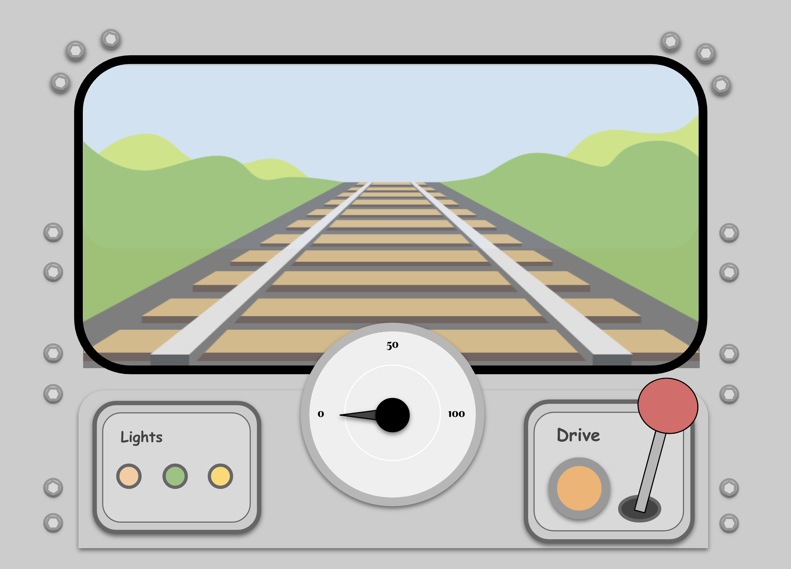
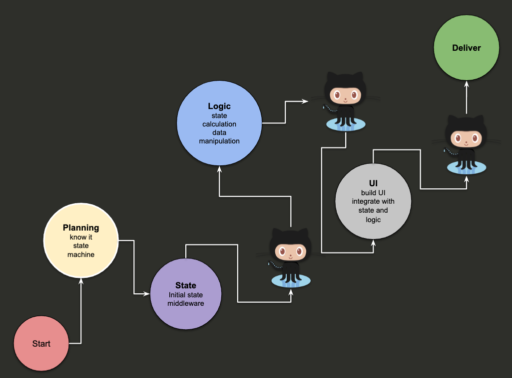

# tog-game

### "tog" in Norwegian is a train. This project purpose is educational to give example how a production feature should be plan and develop, with the following features and patterns:
- Feature based
- Hooks
- Functional

## Version 0.1.0
### What's included?
- Driving dashboard
- Speedometer

### Workflow Diagram

